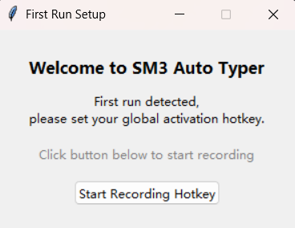

# smassword

[](https://www.python.org/downloads/)
[](https://github.com/Chuangvfan/smassword/blob/main/LICENSE)


> A lightweight password generation and auto-typing tool based on the Chinese national cryptographic SM3 algorithm. No need to store passwords; just remember your "passphrase + salt" to instantly input a strong, unique, irreversible password anywhere with a single keystroke.

---

## 🌟 Features

- **National Cryptographic Standard**: Uses the `gmssl` library to implement the SM3 hash algorithm (Chinese commercial cryptographic standard).
- **Zero Password Storage**: Passphrase and salt exist only temporarily in memory; the program does not store any sensitive information.
- **Global Hotkey Activation**: Customizable shortcut key to quickly bring up the input window.
- **Platform Support**: Currently mainly supports Windows.

---

## ▶️ Usage Instructions

1. **Obtaining the Program**
   - Download the source code or go to Releases to download the .exe file.

2. **First Run**
   - The program will pop up a setup window. Press your desired **global hotkey combination** (e.g., `Ctrl+Alt+P`).
   

3. **Daily Use**
   - Run the program.
   - Press your set hotkey in any application; the main window will appear.
   - Enter your **memorized passphrase** and **salt**. (The passphrase and salt can be any combination of Chinese, English, mixed language, or symbols. However, since the purpose of this tool is to facilitate remembering passwords, please choose an appropriate method.)
   - Press `Enter` or click "Confirm and Type", and the program will automatically input the SM3 hash value (a 64-character hexadecimal string).

4. **Resetting the Hotkey**
   - Click the "Reset Hotkey" button in the main window.
   - The program will close; on the next launch, you'll be prompted to record a new hotkey.

---

## 🔐 Security Notes

- All computations are performed locally, **no network requests** are made, and no information is leaked.
- The output password = `SM3(passphrase + salt)`, offering strong collision resistance and one-way functionality.
- It is recommended to use **different salts** for different services (e.g., `github`, `bank`) to achieve "one site, one password".

> Example:  
> Passphrase: `MySecret!`  
> Salt: `gmail.com`  
> Output: `a3f5...（64-bit hash）` ← This is your Gmail password.

---

## 📁 Configuration File

The program generates a configuration file in the current directory:

```
smassword_config.json
```

Example content:
```json
{"hotkey": "ctrl+alt+z"}
```

> Deleting this file will trigger the first-run process, allowing you to set up the hotkey again.

---

## ⚠️ Important Notes

- Auto-typing relies on `keyboard.write()`. If the target application has special restrictions on pasting/typing (e.g., certain banking websites), it may not work.
- If the hotkey doesn't respond, check for conflicts with other software, or try a more complex key combination (avoid using common keys like `Ctrl+C/V`).

---

## 🧩 Dependencies

- [`keyboard`](https://github.com/boppreh/keyboard): For listening to and simulating keyboard events.
- [`gmssl`](https://github.com/duanhongyi/gmssl): Provides support for SM2/SM3/SM4 national cryptographic algorithms.

---