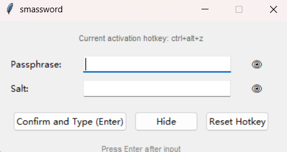

# smassword

[](https://www.python.org/downloads/)
[](https://github.com/Chuangvfan/smassword/blob/main/LICENSE)


> 一款基于国密 SM3 算法的轻量级密码生成与自动输入工具。无需存储密码，只需记住“口令 + 盐值”，即可在任意位置一键输入高强度、唯一、不可逆的密码。

---

## 🌟 特性

- **国密标准**：使用 `gmssl` 库实现 SM3 哈希算法（中国商用密码规范）。
- **零密码存储**：口令和盐值仅在内存中临时存在，程序不保存任何敏感信息。
- **全局热键唤醒**：自定义快捷键快速唤出输入窗口。
- **平台支持**：目前主要支持 Windows。

---

## ▶️ 使用方法
1. **程序获得**
   - 下载源码或前往Releases下载.exe文件

2. **首次运行**
   -程序会弹出设置窗口，请按下你想要的**全局热键组合**（例如 `Ctrl+Alt+P`）。


3. **日常使用**
   - 打开程序
   - 在任意应用中按下你设置的热键，主窗口将弹出。
   - 输入你的**记忆口令**和**盐值**。（口令和盐值可为任意中、英、中英、字符混合，但是此工具目的为方便记忆密码，请自行选择合适方式）
   - 按 `Enter` 或点击「确认并输入」，程序将自动输入 SM3 哈希值（64 位十六进制字符串）。



4. **重置热键**
   - 在主窗口点击「重置热键」按钮。
   - 程序将关闭，下次启动时重新录制热键。

---

## 🔐 安全说明

- 所有计算均在本地完成，**无网络请求**，不会泄露任何信息。
- 输出的密码 = `SM3(口令 + 盐值)`，具有强抗碰撞性和单向性。
- 建议为不同服务使用**不同的盐值**（如 `github`、`bank`），以实现“一址一密”。

> 示例：  
> 口令：`MySecret!`  
> 盐值：`gmail.com`  
> 输出：`a3f5...（64位哈希）` ← 此即你的 Gmail 密码

---

## 📁 配置文件

程序会在当前目录生成配置文件：

```
smassword_config.json
```

内容示例：
```json
{"hotkey": "ctrl+alt+z"}
```

> 删除此文件即可触发首次运行流程，重新设置热键。

---

## ⚠️ 注意事项

- 自动输入依赖 `keyboard.write()`，若目标应用对粘贴/输入有特殊限制（如某些银行网页），可能无法生效。
- 若热键无效，请检查是否与其他软件冲突，或尝试更复杂的组合键（避免使用 `Ctrl+C/V` 等常用键）。

---

## 🧩 依赖库

- [`keyboard`](https://github.com/boppreh/keyboard)：监听与模拟键盘事件。
- [`gmssl`](https://github.com/duanhongyi/gmssl)：提供 SM2/SM3/SM4 国密算法支持。

---
